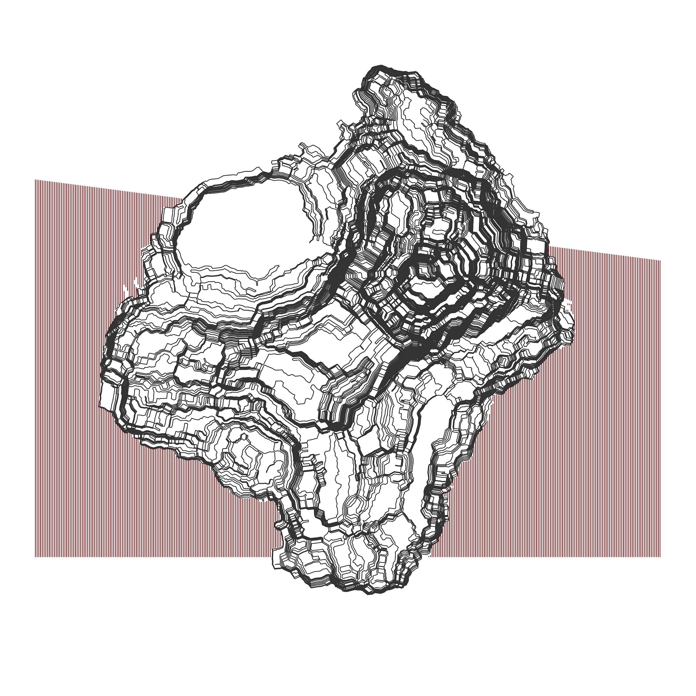
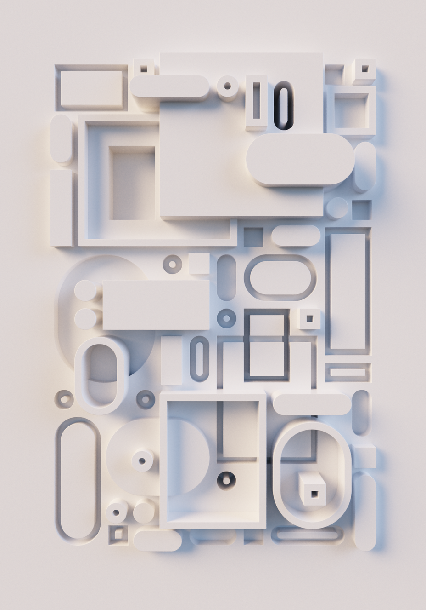

# Artists On The Chain 

## 2025-08-16 Piter Pasma

Here's a bunch of artworks I've selected for my upcoming talk with Artists On The Chain, for Bobbi Bicker, Blockmuse and Kyt.

I had a hard time selecting because I've done so many different styles and things over the years and I'm not sure what will come up to talk about, so here's an overview.

## Early work (demoscene, 1997-2001)

For a very nice overview of my demoscene releases, see:

[https://demozoo.org/sceners/17360/](https://demozoo.org/sceners/17360/)

Two of my 4KB demos from that era have been recorded to YouTube: [Never Bored](https://www.youtube.com/watch?v=gv-gHBz4hgw) and [Meuk](https://www.youtube.com/watch?v=DYopuMRVN6Q). Also [this](/img/demoscene/ikamb99.jpg) is what I looked like back then.

## Older work 

After the demoscene I was mostly busy studying Computational Science at university, of course I kept creative coding, both with audio and graphics. I just had to get the creative juices out, also doing a bunch of graphics design and drawing loads of cartoons. Links to that on request.

It took until 2019 before I started sharing my generative art to the world again, registering an Instagram account and figuring I had something more interesting to post than pictures of my lunch.

*Solar pudding bridge. I also have even earlier stuff but a lot of that is fractals*

*Hilbert Curve explorations. When I made these, I was contacted by a Danish graphics design agency who wanted to buy these designs for an upcoming electronic music festival in Copenhagen. The festival unfortunately never happened due to the pandemic, but I did get paid and this allowed me to buy my Axidraw plotter. It's also the first piece I sold as an artist (and for a not insignificant amount) so I am super proud of that.*

*Polygon subdivision experiment. I like this piece because it's a beautifully simple algorithm, I had not heard of before and gives very interesting results and forms I hadn't seen before. The algorithm is: 1. Find the largest polygon by area (starting with a rectangle filling the page) 2a. Split this polygon roughly in half. 2b. The parameter is "roughly", how uneven is the split. In the image here, I vary the evenness from top (very uneven) to bottom (very even).*

*Sunset melty thing. Variation on the previous algorithm.*

*Asteroid line cut. I like this piece because it's another beautifully simple algorithm leading to unexpected complexity.*

*The idea is you draw a spiral, and then you draw a random line that slices it, and move the spiral apart, perpendicular to that line, while keeping all the lines connected. Seems simple enough but I could not image what it would look like if I repeated this process a few hundred times.*

## Epihyperderpflardioids

Today these warrant a special chapter. I've long been fascinated by these shapes. From an early age, as a budding generative artist, I played with the drawing game/toy [Spirograph](https://www.google.com/search?q=spirograph&tbs=imgo:1&udm=2) where you pin gears to a piece of paper, tracing them with a pen, creating beautifully intricate shapes.

Later I learned about sine and cosine waves and discovered the math behind these shapes and started building my own formulas. Traditional [Spirograph](https://en.wikipedia.org/wiki/Spirograph) shapes are usually categorized as "hypocycloids" or "epicycloids", but my formulas ventured outside of the possible shapes that can be made with only gears. So I decided to call my formulas, "Epihyperderpflardioids" instead.

*Epihyperderpflardioids*

You can also play with [Epihyperderpflardoids live on your phone](https://piterpasma.nl/epihyperderpflardioids/) <-- here. Seriously check this out, it's great fun. Please note to allow the page to read your phone's orientation sensor, because that controls them. Tap for a new image. 

Sometimes people ask me how to pronounce "epihyperderpflardioids", and now, thanks to the power of AI, I have created some audio samples: [Power Metal](EPIHYPERDERPFLARDIOIDS.mp3), [New Wave 1](EPIHYPERDERPFLARDIOIDS-newwave1.mp3), [New Wave 2](EPIHYPERDERPFLARDIOIDS-newwave2.mp3). This was just for fun.

## Skulptuur

At the beginning of 2021 I started working on Skulptuur. I'm a bit too tired to write much more about it now.

It's a photo realistic renderer for imaginary sculptures using only 6370 characters of Javascript code:

*Skulptuur's code*

It uses no libraries, no 3D models, no external input, nothing except those 6370 characters running in your browser to generate any of these 1000 sculptures.

*Skulptuur 375*

*Skulptuur 799*

Skulptuur was released on Art Blocks in September 2021. Check out the full gallery of 1000 outputs at [https://skulpturen.nl](https://skulpturen.nl)

## Rayhatcher

Technically I made the first version of my rayhatcher near the end of 2020, but I put it away for a while to work on Skulptuur. A year later when I took up the project again, I reimplemented everything, and I've always been struck by the atmosphere that even basic geometric forms acquire when rendered using this technique.

*BOOGSTORING*

*7D Paperclip*

I made various projects and 1/1s using the rayhatcher technique. The above images are from Universal Rayhatcher, which was a collaborative project, where artists could write their own mathmatical formulas (in 512 characters) to define a 3 dimensional scene. It was a really experimental idea, but so many people put their effort into it, and it was successful beyond my wildest expectations.

[https://fxwho.xyz/fxhash/urh/](https://fxwho.xyz/fxhash/urh/) -- this is the main gallery page for Universal Rayhatcher

For even more info, also about the other projects, check out my article [Rayhatching Evolution](https://www.fxhash.xyz/article/rayhatching-evolution) about the history of my development of this algorithm. 

## Blokkendoos

Blokkendoos is maybe my favourite project I've done so far. It blends powerful coding and rendering technique with a beautiful generative algorithm.

*Blokkendoos 371*

*Blokkendoos 377*

*Blokkendoos 433*

*Blokkendoos 435*

*Blokkendoos 439*

*Blokkendoos 453*

*Blokkendoos code, 5954 characters*

Check out [Blokkendoos on FX(hash)](https://www.fxhash.xyz/generative/slug/blokkendoos)

## Impossible Sentinels

Impossible Sentinels is my most recent project. Again too tired to write more, so please [read the article I wrote about it](/impossible-sentinels/).

Here's a few outputs from it:

*Impossible Sentinels 35.*

*Impossible Sentinels 39.*

*Impossible Sentinels code, 4750 characters*
