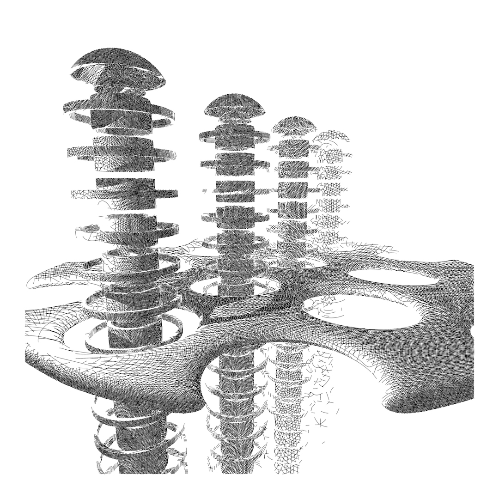

# Visual depth cues
*by Piter Pasma, December 2020*

This article lists the various visual depth cues that I could find. If you're making almost any kind of visual art, I believe you'll benefit from knowing these cues, being able to recognize and practice to use them in various contexts.

*Hyperburger, extra cheese (2020). Notice the mist effect and the perception of depth it provides.*

In a recent discussion the subject of "atmospheric perspective" came up. After trying out various rendering techniques, I was surprised with the effectiveness of this depth cue.

I knew of a couple of other depth cues (the most obvious ones being perspective and shading), but I wondered if I knew all of them, and whether there would be any surprising ones, or ones that I might have been neglecting in my art. So I did a little research.

Some sites say there are "the" 7 visual depth cues. But while I think you can argue about how to divide them up, it's definitely more than 8 of them. In this article, I'm just trying to be complete.

I've divided the cues into monocular and binocular ones. Since most artists aren't making stereographic images, I expect the monocular cues to be most useful, the binocular ones are mainly included for completeness. 

The monocular cues could be further divided into static and moving/dynamic cues, but even static 2D art can sometimes benefit from cues that would seem to relate to non-static scenes. I also found it hard to make a clear distinction, sometimes. 

## Monocular

**Accommodation**. Tension of muscle that changes focal length of the eye. It brings into focus objects at different distances. This depth cue is quite weak, and it is effective only at short viewing distances (less than 2 meters) and with other cues.

**Motion parallax**. We can perceive depth by moving our head, far away objects shifting less than nearby objects. This is why certain birds move their heads like that--because their eyes are on the sides of the head, they cannot use binocular parallax.

**Familiar size**. When we know the real size of the object, our brains use that to estimate distance.

**Relative size**. Two objects known to be similar in size, the largest will be judged as being the closest to the observer.

**Absolute size**. Even if the actual size of the object is unknown and there is only one object visible, a smaller object seems further away than a large object that is presented at the same location.

**Optical expansion**. An object moving towards the observer, the change in size allows perception of depth. A related phenomenon is the visual system's capacity to calculate time-to-contact (TTC) of an approaching object from the rate of optical expansion.

**Kinetic depth effect**. Imagine a wire frame cube that casts a shadow on a wall. If static, this shadow will be interpreted as a 2D pattern of lines. However, if the cube is rotating, this movement information will be used and perception of depth is created.

**Linear perspective**. Parallel lines, horizon, vanishing point. You know, perspective. One article helpfully mentions that this effect is often seen in photos.

**Elevation**. Object position in relation to the horizon. Objects closer to the horizon are perceived as farther away. In addition, if an object moves from a position close the horizon to a position higher or lower than the horizon, it will appear to move closer to the viewer.

**Curvilinear perspective**. At the outer extremes of the visual field, parallel lines become curved, as in a photo taken through a fisheye lens. This effect, although it is usually eliminated from both art and photos by the cropping or framing of a picture, greatly enhances the viewer's sense of being positioned within a real, three-dimensional space.

**Texture gradient**. Closer objects have more detail in their texture, farther away objects are smoother. Especially true if the texture spans all the distance from near to far.

**Occlusion / overlap**. When objects block each other out of our sight, we know that the object that blocks the other one is closer to us. *The object whose outline pattern looks more continuous is felt to lie closer.* Sometimes ambient occlusion is also listed here, but arguably that belongs with shading and shadows.

**Aerial / atmospheric perspective**. Far away things look always slightly bluish or hazy, because of atmospheric scattering. (afaik our brains aren't picky and this works just as well if you use another colour than blue)

**Shading and shadows**. Actually several depth cues:
  - when we know the location of a light source and see objects casting shadows on other objects, we learn that the object shadowing the other is closer to the light source
  - as most illumination comes downward we tend to resolve ambiguities using this information (there's probably some shaded 3D-looking GUI elements you can see right now that use this)
  - bright objects seem to be closer to the observer than dark ones
  - ambient occlusion is very important in determining the shape of things (need a bit more on this).

**Focus blur**. The depth of focus of the human eye is limited and this can act as a monocular cue even when all other cues are removed.

## Binocular

**Convergence**. Our eyes point slightly inward when watching objects close to us. Effective < 10m

**Binocular parallax**. The difference between the different images of both eyes. The most important depth cue for medium viewing distances. Sense of depth can be achieved using binocular parallax even if all other depth cues are removed. 

**Shadow stereopsis**. Even retinal images with no parallax disparity but with different shadows are fused stereoscopically, imparting depth perception to the imaged scene. 

## Triocular

**Trepanation**. The pineal gland is sometimes said to be the "third eye" as it is sensitive to light or something. People who drill a hole in their head in order to expose this third eye, are also more likely to bump into walls, suggesting a decrease in depth perception. Other theories suggest that these cases are not so much lacking in depth perception, but clarity of thought and basic common sense. People with a hole in their head did not respond to requests for comment.
