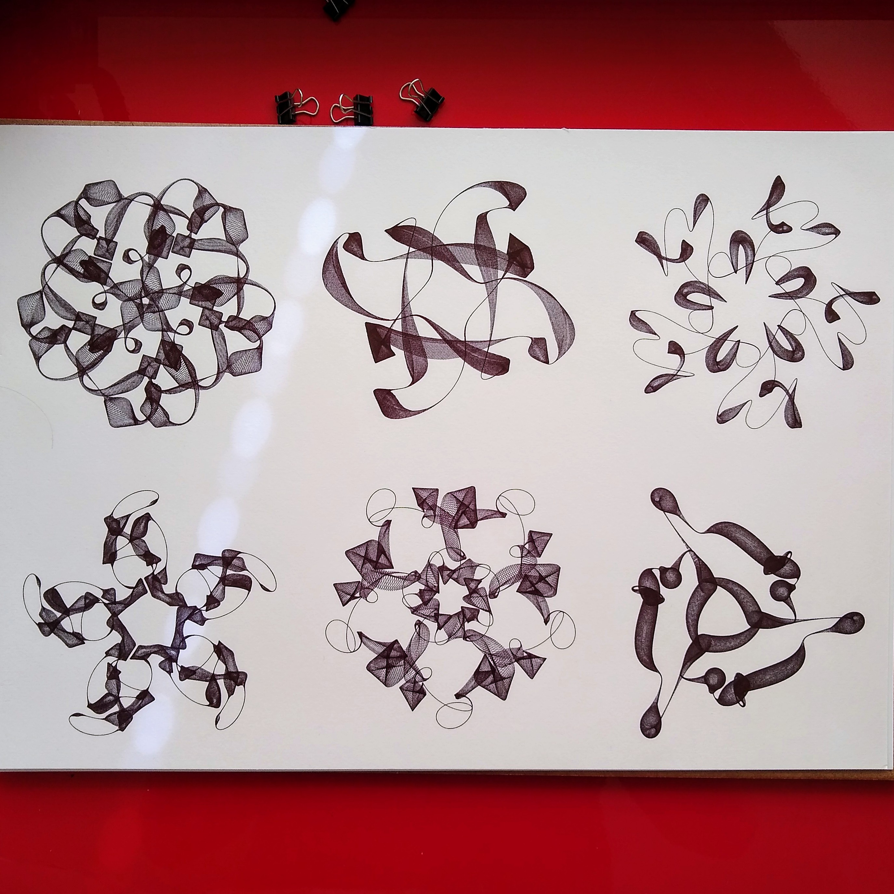

# Over Epihyperderpflardioids

*Geo epihyperderpflardioids in black ballpoint, August 2020*

Ik heb deze figuren "Epihyperderpflardioids" genoemd. 

De formules zijn ruwweg gebaseerd op die van Spirograaf (Spirograph), die in wiskundige termen "hypotrochoids" en "epitrochoids" worden genoemd. Mijn formules vallen daar niet helemaal precies onder en hebben meer parameters, dus heb ik het woord "Epihyperderpflardioids" bedacht.

Ik denk dat dit de eerste keer is dat ik dit woord gebruik:

[Epihyperderpflardioids, March 2020](https://www.instagram.com/p/B-M6rgOHBUV/?img_index=1)

Maar ik was al een tijdje langer bezig met deze figuren en formules:

[Harmonic Chains, Oct 2019](https://www.instagram.com/p/B3SJjjvIDHs/?img_index=1)

Het idee is dat je leuke vormen krijgt als je verschillende roterende vectors bij elkaar optelt. Alleen zijn er heel veel manieren om dit te doen. Ik besloot het systematisch aan te pakken, en te kijken wanneer een bepaalde combinatie van parameters een symmetrisch figuur oplevert. Dat is namelijk niet altijd voor de hand liggend, en bleek een erg interessante restrictie.

Ik heb een artikel geschreven over deze zoektocht: [How to make interesting rotating things](rotating) -- hoewel ik ondertussen de formules nog wat beter begrijp, misschien schrijf ik nog een keer een uitgebreider artikel.

# Meer Epihyperderpflardioids

Je kan mijn eerste mints van Epihyperderpflardioids vinden op Hic Et Nunc:

https://objkt.com/@piterpasma?search=epi (de zwart/witte "Syncopated Epihyperderpflardioids" zijn animaties)

Ik heb ook nog een collectie [Epihyperderpflardioids op FX(hash)](https://www.fxhash.xyz/generative/slug/epihyperderpflardioids) uitgebracht.

Verder heb ik nog een live code bewegende random Epihyperderpflardioid generator gemaakt: [Live Epihyperderpflardioids - piterpasma.nl](https://piterpasma.nl/epihyperderpflardioids/). Deze kan het best op een mobile device worden bekeken, omdat het de orientatie sensor gebruikt voor het moduleren van de parameters. Klik voor nieuwe.

[Monochromatic semi- epihyperderpflardioids with extra derp](https://www.instagram.com/p/B-9jsCpH15G/?img_index=2)  
[10 000 Epihyperderpflardioids, Genuary1 2022](https://www.instagram.com/p/CYMe-n2NQWa/?img_index=1)  
[Epihyperderpflardioids with Amen breaks, Genuary28 2021](https://piterpasma.nl/gen28/)  
[Grid of Epihyperderpflardioid permutations, Genuary25 2021](https://www.instagram.com/p/CKhIKg2nqYT/)  
[Epihyperderpflardioid circle packing, Genuary16 2021](https://www.instagram.com/p/CKIDWjAn8Bx/?img_index=1)  
[Epihyperderpflardioids in 809 characters of code, Genuary5 2021](https://piterpasma.nl/gen5/)  

Ik ben ook erg trots op deze geanimeerde Epihyperderpflardioids: [Groen](https://www.instagram.com/p/CBqQjU2HqTt/), [Magenta](https://www.instagram.com/p/CBn5kr4nGtI/), [Oranje](https://www.instagram.com/p/CBst6pwnHjG/), [Blauw Geel](https://www.instagram.com/p/CBvtM5Rn2l3/), [Pseudo semi epihyperderpflardioid](https://www.instagram.com/p/CByu9R_HAzM/).

# Werk van anderen

Nadieh Bremer's Art Blocks project "Rotae" (Nov 2021) gebruikt vergelijkbare formules: [Rotae (Nov 2021)](https://www.artblocks.io/legacy/collections/presents/projects/0xa7d8d9ef8d8ce8992df33d8b8cf4aebabd5bd270/194)

Nadieh heeft mij destijds nog gevraagd of ik dit okay vond, maar ik wil geen claim leggen op wiskundige formules. Bovendien bleek uit haar onderzoek dat anderen deze familie van functies/vormen ook hebben onderzocht: 

[John D. Cook - Mystery curve](https://www.johndcook.com/blog/2015/06/03/mystery-curve/)

[Math less traveled - Random cyclic curves](https://mathlesstraveled.com/2015/06/04/random-cyclic-curves-5/)

Maar iedereen doet het ook net op een subtiel andere manier. Mijn Epihyperderpflardioids hebben bijvoorbeeld meestal een hoog frequente derde rotator, met oscillerende radius, die tekent de typische "spiraal blobjes" ("bulges"), die Epihyperderpflardioids hebben, maar ik niet heb gevonden in andere mensen hun formules. Dat komt ook omdat dit puur een aesthethische keuze was en niet echt wiskundige basis heeft.

# Hoe spreek je "Epihyperderpflardioids" uit?

Om mensen te helpen met de uitspraak van "Epihyperderpflardioids", heb ik de hulp van Suno AI ingeschakeld::

[Epihyperderpflardioids GO](https://suno.com/song/9ff6b9b2-4cba-4447-83ab-638760b2c187) [mp3](EPIHYPERDERPFLARDIOIDS.mp3)  
[Epihyperderpflardioids New Wave 1](https://suno.com/song/d12b5489-0a2a-4154-8a44-02279bd34058) [mp3](EPIHYPERDERPFLARDIOIDS-newwave1.mp3)  
[Epihyperderpflardioids New Wave 2](https://suno.com/song/fe01624f-e62b-4481-90d0-3c254b374764) [mp3](EPIHYPERDERPFLARDIOIDS-newwave2.mp3)  

