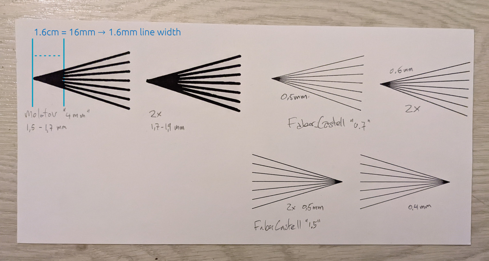

# Measure the line width of your pens with a plotter

I made an SVG file to accurately measure the line width of any kind of pen, using your plotter.

Download the file here: [line-test.svg](line-test.svg)

*In this photo I have plotted line-test.svg a few times on a piece of paper, to test multiple pens.*

## How does it work?

The idea is that you have this bunch of lines going outwards. On the left side they are 0mm apart, and on the right side they are 5mm apart. They do this over a distance of 5cm (50mm). This means that for every cm (10mm) they move 1mm further apart.

Now you can measure the distance at which the thick lines actually no longer touch each other. You divide this distance by 10 (or change the cm to mm) and you get the line width. Easy as that!

This SVG actually contains two sets lines. In the one set it goes over each line once, and in the other it draws every line and then also back. This is to see how much difference it makes going over a line once or twice.

Hope that makes sense :-)

## A few notes

On the photo, in my pencil annotations where I wrote the line width between quotes like Faber Castell "0.7", it means it has "0.7" written on the pen, not what I actually measured.

As you can also see, the Faber Castell "0.7" and "1.5" hardly made a difference in line width. That is not to say the pens are wrong really. It's mainly to do with the shape of the tips, and with the plotter holding the pen in a very peculiar way, that causes the line width to be different than hand drawing. This is why it's super useful to measure it!

Another advantage is, when I generate SVGs for plotting, I use physical units (millimetres). Now I can also set the stroke-width attribute of the paths to the correct line width. This doesn't matter for plotting, but it will mean that the on screen preview of this SVG will be very true to the plotted result.