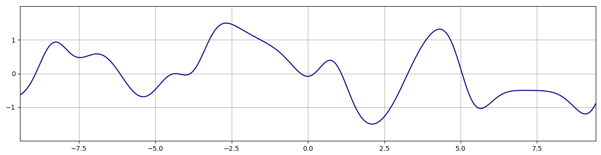

# How did I do make the thing?


## Why don't you just share us the code?

Well honestly, the code that I write has a very singular purpose: to render one of my artworks. And it does this at arbitrarily high resolution. And with endless variation. And I just don't feel quite comfortable giving that away in a ready-to-use package. But it's *not* about hiding my method or keeping secrets. Because that's what this article is going to be about! :-)

## Javascript to Rust

The original prototype of this project was written in Javascript, using (small parts of) the P5js library. Very promising images, but took over half an hour to render at medium resolution. A friend had been poking me to try out Rust for a while, and I figured this might be a good motivation. That's one reason you might not even *want* my code, because I've only been writing Rust for a week now, and it's probably not very idiomatic. I've also been told that some of the cleverer bits might *panic* in debug mode, which I'm going to fix eventually, but seriously in debug mode it runs slow as molasses, you didn't want to do that any way.

One thing I like about Rust so far is that, once I had converted all the code (which was tedious because I had to refactor) and I compiled with no more errors or warnings, the code was pretty much correct. It produced an image that was only slightly wrong because I had made a typo in the formula. Also that it is indeed, *fast*. As well as much less unpredictable to optimize than Javascript.

## What the thing is roughly

So imagine a large, semi-translucent paper towel. Crumple it up, and take a picture cropped in such a way that you see only paper towel. That's kind of what we're looking at here. Also, the paper towel is infinitely stretchy.

So the picture is a square, let's call an arbitrary point on this plane `(x, y)`. Now the paper towel is also a square and we can call an arbitrary point on the towel `(u, v)`. When the paper towel is unfolded and you take a picture of exactly the entire towel, then the `(x, y)` coordinates exactly match up with the `(u, v)` coordinates. But when we crumple it and then take the picture, this changes.

We can define how the towel is crumpled up by defining a function that takes as parameter a `(u, v)` coordinate, and returns the `(x, y)` coordinate of that piece of towel in the final picture. Let's call this a *mapping* from `(u, v)` to `(x, y)`.

## The wobbly function

This is a subset of (a growing number of) various techniques I use in many of my artworks. I call them "wobbly functions", for lack of a better name. The noise function in Processing, which you may have used, is a kind of wobbly function. It's a little too rough for my purposes and it doesn't quite "swing". That's why I usually use various combinations of sine waves (often added or fed back into each other, but not more than once). The results are functions that change value smoothly, flow, and can have harmonious features (either by accident or by restricting the frequencies to a small number of ratios).


*A graph of the function `sin(t+p0 + sin(t*0.7+p1)) + 0.5 * sin(t*2+p2 + sin(t*2*0.7+p3))`, with p0..3 being random numbers in the range 0..TAU*

In this case however, I had used a few too many sine waves. After the speed-up from using Rust, this turned out to be the biggest factor in rendering time. So we have to do something cleverer (props to Stevan for setting me up on the idea).

We need a 1D wobbly function, which means that it takes a floating point value as a parameter, and also returns a float. We're gonna make an array with 8 values in it (at initialisation), and interpolate between those values using the smoothstep function. Cyclically with the last value interpolated back to the first. Also, I pick the values for the array alternating from `rand(-1.0, 0.0)` and `rand(0.0, 1.0)`, so that the function always swings back and forth.

The function that takes a float `t` as input and outputs the interpolated value looks like this:

```rust
fn wobl(&self, t: f64) -> f64 {
  let i = (t.floor() as usize) & 7;
  let mut f = t - t.floor();
  f *= f * (3.0 - 2.0 * f); // smoothstep
  self.wav[i] * (1.0 - f) + self.wav[(i + 1) & 7] * f
}
```

Note that in Rust a float is called `f64` and the last line (without semicolon) is the return value. The integer part modulo 8 (or `& 7`) is calculated in the variable `i`, and the fractional part is stored in the variable `f`. Then `f` is transformed through the smoothstep function, and used to mix two consecutive values from the array `self.wav`, indexed by `i` and `(i + 1) & 7` (i + 1, modulo 8).

## How to map

Using this wobbly function, we're going to build a mapping function that transforms input coordinates `(u, v)` to warped `(x, y)` screen coordinates.

```rust
  fn f(&self, p: Vector2<f64>) -> Vector2<f64> {
    let a = 1.5 * (self.wobl(p.x * self.ff.0 + self.phi.0) 
        - 1.5 * self.wobl(p.y * self.ff.1 + self.phi.1)) + TAU * 0.25;
    let b = 1.5 * (self.wobl(p.y * self.ff.2 + self.phi.2) 
        - 1.5 * self.wobl(p.x * self.ff.3 + self.phi.3));
    let va = vec2(a.sin(), a.cos());
    let vb = vec2(b.sin(), b.cos());
    let mut v = vec2(p.x + 0.2 * p.y, p.y - 0.2 * p.x);
    v += 0.3 * (va + vb);
    v * HEIGHT + WH2
  }
```

First we calculate two angles `a` and `b`, which are calculated from a combination of the wobble function and the coordinates. The frequencies `self.ff` are chosen at initialisation from `rand(2.0, 4.0)` and the phases `self.phi` from `rand(0.0, 8.0)` (needs to be exactly 8 because this is the period of our wobbly function). One angle is rotated a quarter turn by adding `TAU * 0.25`. From these two angles we create two unit vectors.

Then we take the plain `(u, v)` coordinate, and rotate it a little (constant angle). Then add both unit vectors, multiplied by a small constant like 0.3. This final result is then multiplied by the height of the image in pixels, and translated to the centre of the image, and that's our `(x, y)` coordinate.

By the way I use the `cgmath` crate to get the `Vector2` type.

## How to draw

We're gonna generate gazillions of random `(u, v)` coordinates. We do this cleverly, so we pick from the (rectangular) range that, when warped, falls entirely within a set margin outside the screen. For each one, we transform it with the mapping function to a screen coordinate.

I use a gigantic RGBA float buffer to accumulate each point, using an alpha (opacity) blending formula, with opacity of 0.05. Also it does linear subpixel interpolation. For this buffer, I use the `f32` type to save memory, but it's still `4 * 4 = 16` bytes per pixel. I draw the points with low opacity, so everything is smooth and averages out. It also takes longer, which makes you appreciate the end result more.

When a gazillion samples have been accumulated, this buffer is converted to RGBA bytes, and then saved as a PNG using the `png` crate.

If we use this technique to draw black points on a white background, you get something that kinda looks like this:


## How to do what I did

But I had coloured squares. I used a trick for that :) The trick is as follows.

First, the black lines.

After we pick a random `(u, v)` coordinate, but before we warp it, we're going to do something to it. First split it into its integer and fractional parts, respectively `(ui, vi) = (u.floor(), v.floor()` and `(uf, vf) = (u, v) - (ui, vi)`. The fractional parts are between 0 and 1 and if you raise this to, say, the 3rd power, it *still* ranges between 0 and 1. Except that now there are a lot more numbers close to 0 and less of them close to 1. So the distribution changes. This is what we do to either `uf` or `vf` (50% chance of picking one or the other). Then we add the integer part back, so now we got a random coordinate over the same range, but every fractional part is skewed towards its lower end. This divides your worbly surface into blocks, and plots more points at the "left" and "top" edges of the block, making it darker. We also want the other two edges darker, so we add a 50% chance of flipping the fractional parts, that is the fractional part becomes `(1 - uf, 1 - vf)`. Do that and you got this nice shaded grid texture:


Comes the last part, colour! It's pretty easy, I take the integer coordinates `(ui, vi)` and I hash them together to form a single number, modulo 8 (`& 7`) to index a palette of RGBA triplets (I don't use the A — yet — and set it to 255 at conversion). The hashing is done in two lines with prime multiplications and a xorshift, experimenting until I got something simple that looks shuffled enough. Then for each sample I give it an 80% chance to get coloured unchanged like this, or 20% chance to become a black pixel according to the grid-algorithm above.

So what that looks like, you can see in the first image of this article :) But I'll include another one here. You'll notice it looks different because I probably messed with the parameters:


Also it's rendered at slightly lower quality. And there's one other important thing that's actually different, if you can spot it. But that's a secret trick for another time :)

## Blabla bla

So I think I covered almost everything and you should have a pretty good idea of how it was done! I hope it inspired you to try something for yourself, and that it was better than trying to decipher a long code listing. 

If something is super unclear, or you have a question, or maybe you have a great idea? Feel free to shoot me a DM on Instagram: @piterpasma.
