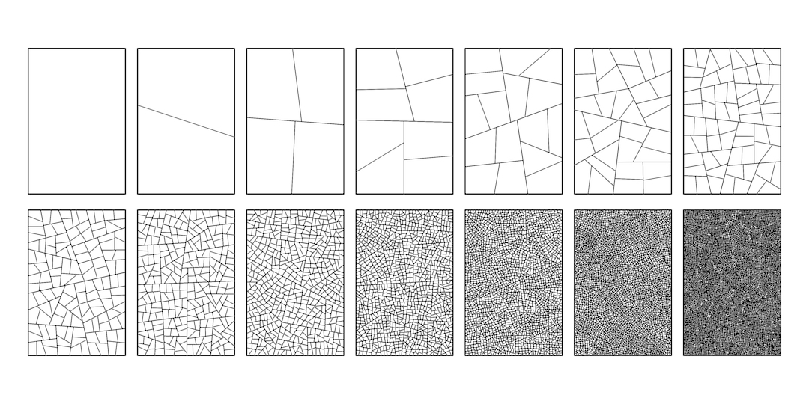

# How to split polygons unevenly
*by Piter Pasma, February 2020*

Several people wanted to know how this works. And it's not even that complicated!

*Totally not complicated.*

First, a quick summary: Start with a big square, slice it roughly in half along a straight line. Then you find the largest polygon (or one of the largest), split it, and repeat. You can slice a polygon either evenly (roughly in half), or unevenly. If you do it evenly, it looks like your usual garden-variety polygon subdivison. But if you do it unevenly, what happens is that you slice off a smaller bit of the polygon. The larger bit will be a bit rounder than before, but not much smaller. This is what causes the "holes". I vary the parameter of how even the polygon is sliced, over the image. More even at the bottom, less even at the top.

That's it! Think about it, slicing polygons unevenly just makes holes. You could even do this with pen and paper and a *lot* of patience.

The following is an example of even subdivision, where the polygons are sliced roughly in half: 

*Garden-variety polygon subdivison.*

And the image below shows uneven subdivision. As you can see it creates holes!

*Uneven polygon subdivision.*

## Placeholder text

Really this isn't that important. But there are some details, which are like smaller aspects of the larger picture. That is why we call them details. Please do read on if you haven't had enough.

You can easily pick the "largest" polygon by its circumference. No need to calculate area or anything more complex.

You can also map the circumference of the polygon so that you can index it with a number between 0 and 1. You start at 0 at an arbitrary vertex and you go around the polygon, until you end at 1 at the same vertex.

Then to slice it, pick two numbers between 0 and 1, corresponding to points r0 and r1 on the polygon circumference. If the numbers are (about) 0.5 apart (modulo 1), they divide it roughly in half. If they are less than 0.5 apart, they divide it unevenly. They can't be more than 0.5 apart since you're calculating modulo 1. Just like you can't cut a polygon into more than half, without also cutting it into less than half!

So you decide on a distance (this is the parameter you can vary). Then pick r0 randomly between 0 and 1. Then r1 is just the distance added to r0, modulo 1.

Now you have all the vertices you need and can easily slice the polygon.

One important trick is to always divide the polygons (roughly) evenly for the first N (5 or so) generations. You'll notice that it just looks better, especially if you vary the parameter across the screen.

## Variations

* You can shrink the polygons a tiny bit each time you split them.
* You can rotate the polygons a tiny bit each time you split them.
* You can draw the polygons in various exciting ways.
* You can vary the parameter in various exiciting ways.
* You can start out with various exciting shapes or poly meshes.

*This is what happens if you shrink and rotate the polygons every time they are split.*
