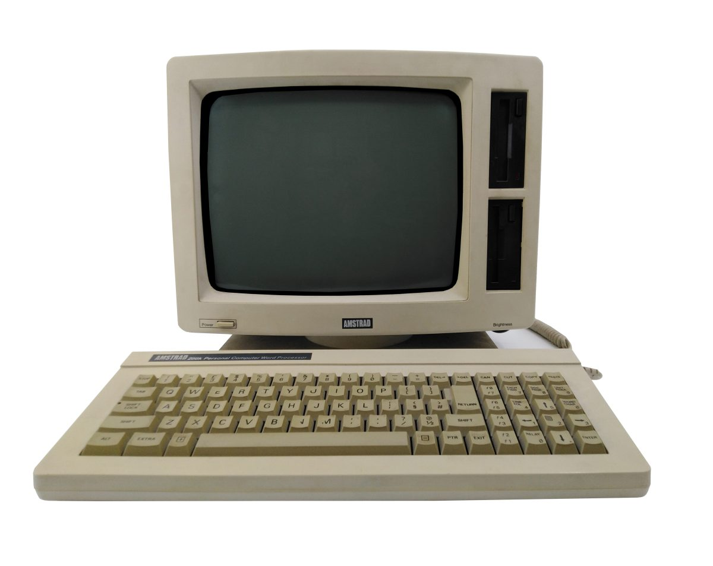
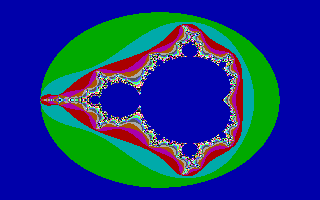
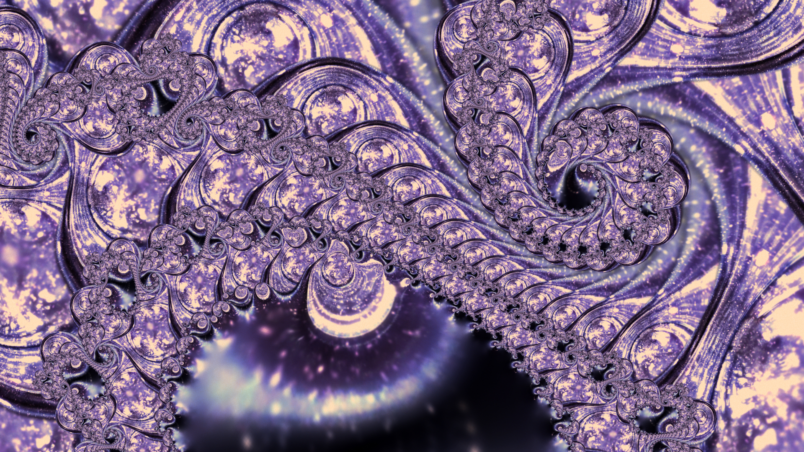
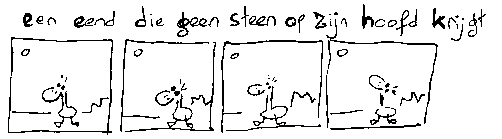
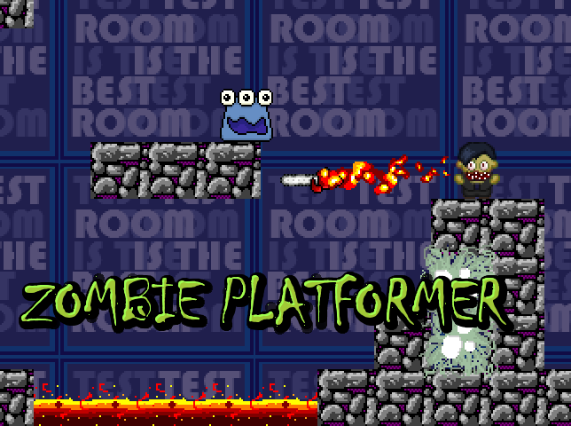
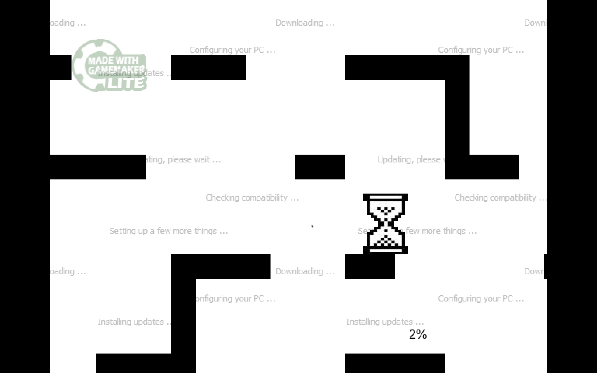

# PITER PASMA: THE PARTIALLY NEVER TOLD BEFORE REAL STORY

## it was probably 1989 or so

My mom brought home a computer from her work. 


_(it was an Amstrad PCW running CP/M plus, it doesn't matter)_

I had no Internet, so I just borrowed random computer books from the small local library in the hope they would work for this particular computer. Most didn't.

After messing around with the default word processor, I figured out that if you inserted the boot disk in reverse (yeah), you got a command line input where if you typed `BASIC`, you got a programming environment. 

### Second basic program 

```
10 PRINT "/"
20 PRINT "-"
30 PRINT "\"
40 PRINT "|"
50 GOTO 10
```

try out demo at [https://gw-basic.com/](https://gw-basic.com/). It will probably go too fast though.

## 1995

### fractals and patterns



Got a disk with FRACTINT, fractal explorer program from a collegue of my mom.

Later also got a college hand out from that collegue explaining about complex numbers, the math behind famous fractals such as the Mandelbrot and Julia sets.



Pictures would often take 30 minutes to render.

## 1996 or 1997

Classmate gave me a disk with [ASPHYXiA demoscene tutorials](http://www.textfiles.com/programming/astrainer.txt) and the Borland Turbo Pascal IDE, allowing me to write much more powerful programs using Assembly language and Pascal instead of (slow) BASIC.

### DEMOSCENE

* What is a demo? (short explanation)

Somebody other than me collected all my demoscene productions (even ones I had forgotten about) and they're all available in various demoscene archives and FTP sites: [https://demozoo.org/sceners/17360/](https://demozoo.org/sceners/17360/)

Generative Art could learn a thing or two about archival practices from the Demoscene.

Show my 3rd 4KB demo [Never Bored](https://www.youtube.com/watch?v=gv-gHBz4hgw), released as part of a demogroup called Revolution.

Optionally, my 4th 4KB demo [Meuk](https://www.youtube.com/watch?v=DYopuMRVN6Q), it has cool music.

## 1998 University Computational Science

Where I learned all sorts of useful stuff such as real proper MATHS and getting even better at programming, fundamental computer science stuff, and all sorts of things. Also took extra-curricular classes in Ethics, (generic overview of) Philosophy and (Dutch) Intellectual Property Law (probably somewhat dated by now).

I didn't have a lot of time for art, except I drew a lot of cartoons during classes.



Experiments with code? Sound?

Burn out in 2008, couldn't code for half a year, slow progress since then.

Also literal fire in 2009, lost a bunch of digital archival material (harddisks). Cartoons fortunately were safe and only got minor smoke damage.

## 2012 Volunteer work 

Volunteer work, teaching kids to code and cool computer stuff. Video games, gamemaker. 


*Zombie Game*


*Windows Update Game*

Show Zombie Game / Windows Update Game.

Some early work

## 2015 to now: Lots of art

Show the big code art folder. *(I mean the Dropbox copy from the backup that has been updated most recently)* 

* 2015 pathtracer: first encounter with SDFs, a very elegant way of mathematically describing 3-dimensional shapes

* 2015/2016/2017: orbit trap fractals. Ink splats. Other ones.

In 2019 I started posting my stuff on Instagram :) So we can look there.

* More orbit trap fractals

* Experiments with sine waves

* IFS inspired fractals / fractal flame-ish art

Transitioning more to SVG-based art for resolution reasons.

* Solar pudding, etc

January 2020: Hilbert Curve experiments: Designs bought by Strøm DK Festival. I got paid but the festival didn't happen because of COVID.

Used the money to buy an Axidraw A3/V3 plotter!!! But this took a while.

Meanwhile, 

* subdivision algorithms 
* first attempts at scribbling, images to line art
* EPIHYPERDERPFLARDIOIDS
* animated epihyperderpflardioids

Until plotter time

Selling a few plots here and there

Back to SDF time, trying to make SDFs plottable but how?

Scribbling, stippling

Until: RAYHATCHING

also: GENARTCLUB

## 2021: GENUARY AND NFTs

Genuary

Hic et Nunc

[Raster Art: Piter Pasma](https://www.raster.art/artist/piter-pasma)

Sky above the port

Desirotron

Skulptuur

Hypergiraffe

## 2022: GENUARY AGAIN

Exploring shaders

Also plotter based scribbling

Hyperwillows

October: Industrial Devolution

December: GEOMORPHISM

## 2023 and on

GENUARY every year (still going)

Feral File

Yip & Yap

Blokkendoos

Bright Moments Finale

Universal Rayhatcher

Impossible Sentinels

Then, I took a bit of a break. Did some lambda calculus for fun, but it didn't go anywhere. Also trying to build a synthesizer on an ESP-32.

Masks.