# demoscene

Here's a very complete list of all my productions: [Ritz on Demozoo.org](https://demozoo.org/sceners/17360/). Also has links for download in case you want to try and run the demos yourself. You probably want to use the [DOSBox emulator](https://www.dosbox.com/).

Dutch tech web magazine *Tweakers* wrote a cool article about the demoscene, also featuring me: [Duitsland erkent demoscene als cultureel erfgoed waaronder kunst van Nederlander](https://tweakers.net/geek/179762/duitsland-erkent-demoscene-als-cultureel-erfgoed-waaronder-kunst-van-nederlander.html).

## 4KB demos

A 4KB demo is a computer program whose executable is no larger than 4096 bytes. I wrote all my 4KB demos in 80x86 assembly.

### Design?!

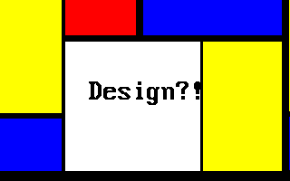
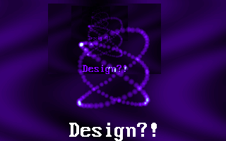
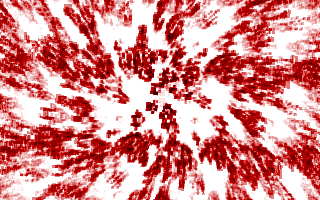
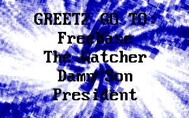
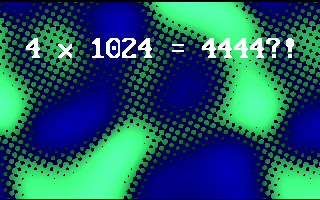
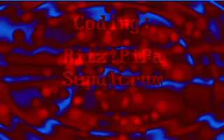
{:.inline}

Second place in the Bizarre 1998 4KB competition.

*Design* was produced in 3 days by Sepulcrum of Revolution and me, before the Bizarre 1998 demoparty. We used mostly small demo effects that I had already written, which I rewrote to be smaller, and coded a few new ones, Sepulcrum glued everything together.

### Organic

First place in the Ambience 1999 4KB competition.

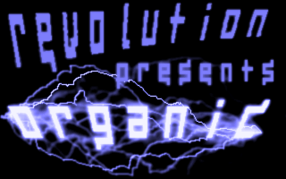
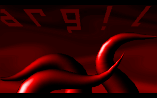
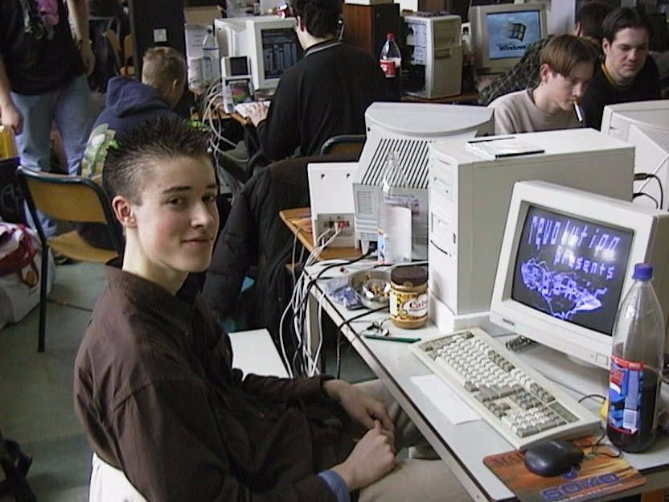
{:.inline}

### Never Bored

Second place in the Takeover 1999 4KB competition. [Watch on YouTube](https://www.youtube.com/watch?v=gv-gHBz4hgw).

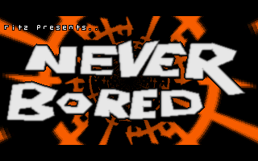
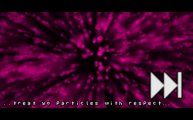
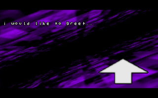
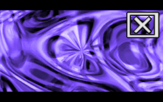
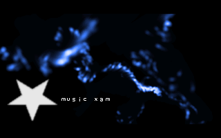
{:.inline}

### Meuk

Second place in the Mekka & Symposium 2000 4KB competition. [Watch on YouTube](https://www.youtube.com/watch?v=DYopuMRVN6Q).

This is my most complex 4KB demo yet, featuring a hand written software synthesizer in about 1100 bytes, as opposed to using the AdLib chip as in my previous demos.

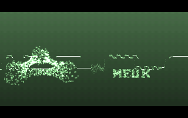
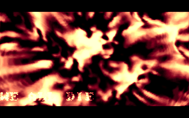
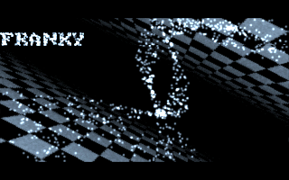
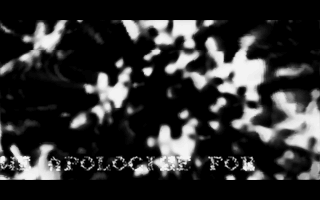
{:.inline}

### Other productions

A BBS is something of pre-internet days, similar to a webserver, except you literally called up somebody else's computer over the phone line. One purpose of BBSes was file sharing, and a BBS would often automatically include tiny executable files inside the ZIP files that people downloaded, advertising that BBS. Such a program is called a "BBStro", and most of them even predate my demoscene work.

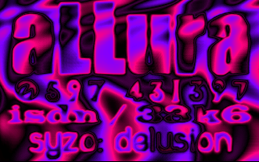
*Allura BBS, BBStro, 1998*

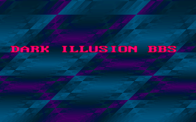
*Dark Illusion BBS, BBStro, 1998*

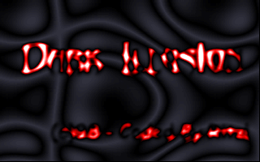
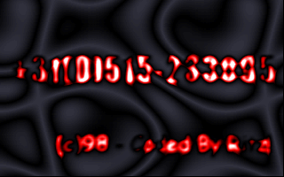
*Dark Illusion BBS, BBStro, 1998*
{:.inline}

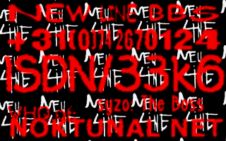
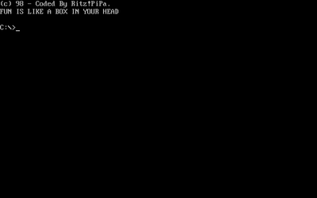
*New Line BBS, BBStro, 1998*
{:.inline}

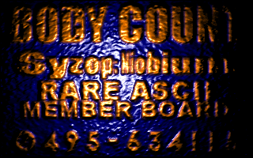
*Body Count BBS, BBStro, 1998*

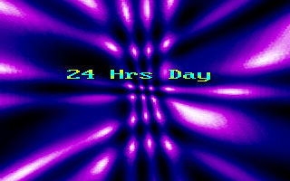
*Legalized BBS, BBStro, 1998*

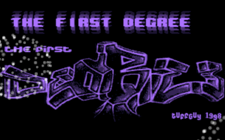
*The First Degree BBS (code), BBStro, Dec 1998*

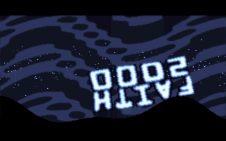
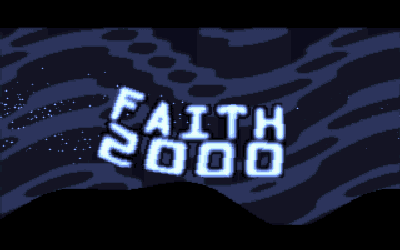
*Faith2000 Cracktro, Cracktro, 1999*
{:.inline}

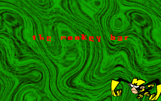
*The Monkey Bar BBS, BBStro, Dec 1999*

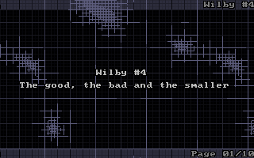
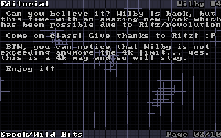
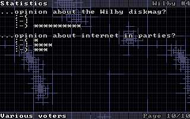
*Wilby #4, Diskmag (code/interface), Jan 2000*
{:.inline}

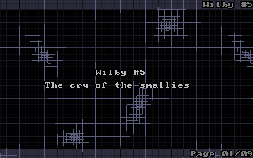
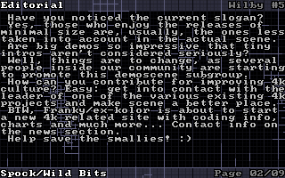
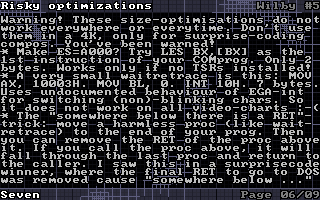
*Wilby #5, Diskmag (code/interface), Mar 2000*
{:.inline}

<!--
Holy crap, I just found out about a Demoscene archive that actually has all of my old productions on it. Even my old stuff that I made for a few BBSes, before I started releasing 4k demos at demoparties. This is ancient stuff, from 1998-2001 :-) I honestly thought some of these were lost to time.

There's a couple of things in this list, my 4k demos (also called 4k intros) that I've talked about before.

There's two editions of a 4 kilobyte diskmag called Wilby, that I completely forgot about. This was a digital magazine about the 4 kilobyte and size coding scene. The diskmag itself was also 4 kilobyte (compressed text + executable). Somebody else wrote the articles but I coded the interface and visual fx. I also wrote the text compression algo.

There's a couple of BBStros in there -- I will explain the reply thread, what those are.

Be sure to check out the screenshots of all these things in the link :) 

If you're curious to see them running live (you can download the executables), they need a 1998-era Windows environment and a Soundblaster card with default settings. There is a program called "DOSBox Emulator" that can do this. They should run with ease on modern hardware. (If you do so, let me know :) )

What I find especially interesting is that after all those years, I think there's still a recognizable style.

What's also interesting is that some effects you still see today in gen.art (although in higher resolution).

I will put some more info about these productions and the effects in the reply thread for those interested. Some effects are a bit hard to see from the screenshots if they're not moving.

Yes, the screenshots are tiny. The most popular graphics resolution at the time was called "mode 13h", it had 320x200 pixels. You had a palette of 256 colours that you could select from 24 bit RGB (I usually loaded one or two gradients into the palette).

These were simpler times, when memory was divided up into 64kB "segments". One such segment had the address 0xA000 and this was the video memory. Change a byte there and next screen refresh it would be on the display.

So, a BBS is another computer that you call, over the phone. On a landline. This was before the Internet (well it was before I got access to the Internet). A BBS functions a bit like a web server, except everything is text-only. Though the text can have 16 colours and this gave rise to something called ANSI-art, but that's another story.

You can do all sort of website-like stuff on a BBS, but an important part was of course file sharing. In order to promote themselves, many BBSes automatically added text files in every ZIP. However some BBSes also liked to promote themselves in an audio-visual manner. Download speeds were about 4-7 kB/s, so video was not an option. 

So what they did was ask people to write very very tiny executables for them, that displayed cool graphics and possibly played music. These executables were called "BBStros" and would be automatically included in every ZIP.

I see one of them is called a Cracktro, apparently Faith2K was a cracking group, not a BBS. Oh well.

Quad subdivisions in the Wilby screenshots :D Distorted noise in the Monkey Bar. Bouncy jelly physics in the Faith2K intro. 

So the first Dark Illusion BBS intro is not dated, but I'm pretty sure it's the oldest, possibly from 1997. The texture you see is the (x XOR y) pattern, and if I remember correctly it was distorting/wobbling/stretching.

Many of these BBStros have music with them. The music is not mine. I preferred not adding music, because it usually added about 10kB, and my executables were often less than 2kB without it. But the SysOps (BBS owners) wanted music. I've no idea who made it and whether it was used with permission (probably not). The music came in .MID format and was played through the Adlib chip in the Soundblaster (very simple chip that did digital FM synthesis).

Also, I like seeing that I totally used the "aesthetic" colour scheme in the 90s ;-)

-->

