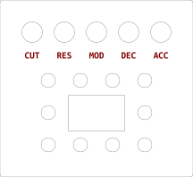
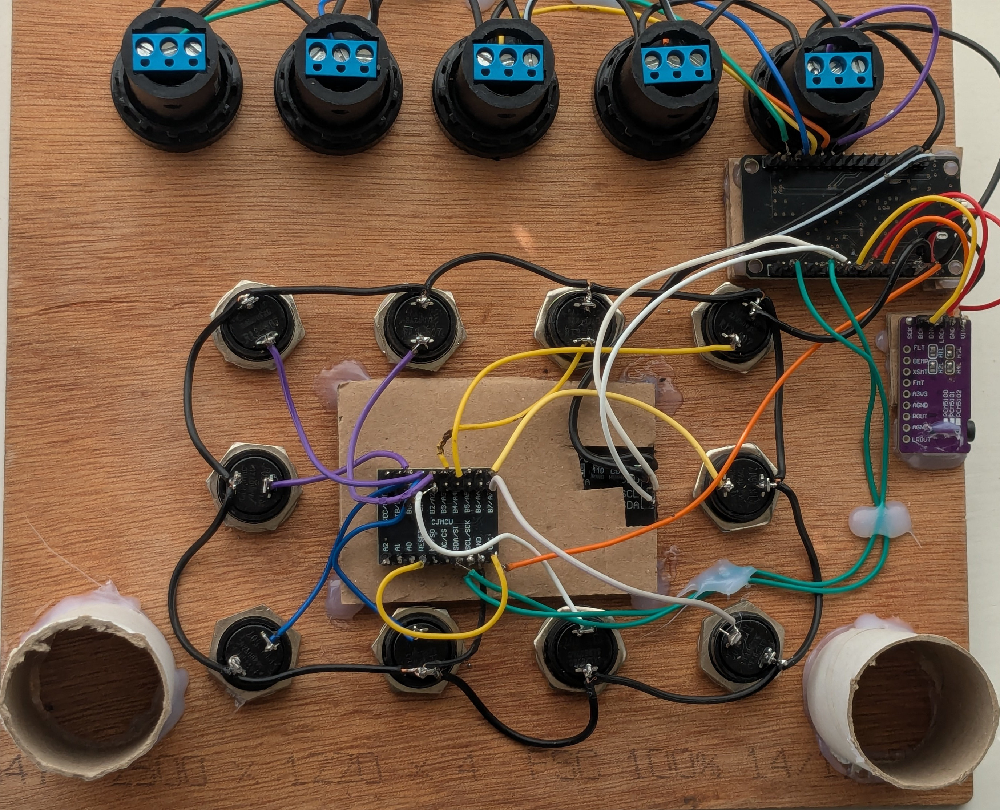

# How to build the AUDIOGURK

The AUDIOGURK is an ESP32-based synthesizer running at 192KHz sampling rate, produces swankily modulated low-pass resonance filtered sawtooth waves, a.k.a. **_ACID_**.

## what you need

* Microcontroller: **ESP32-D**, or any ESP32 WROOM compatible with at least 30 pins
* [Display](#display): **OLED SSD1309** 128x64, 2.42 inch, 4 pin I2C version
* Audio DAC: **PCM5102**, I2S
* GPIO expander: **MCP23017**
* 5 potmeters, 10 KOhm (but 5 KOhm also works). The optional front panel is designed for  model **LA42DWQ-22** potmeters, see below.
* 10 momentary buttons. The optional front panel is designed for **16mm** wide threaded momentary buttons.
* Wires. Try to use slightly consistent colours. Red/orange/white for voltage wires, black/blue for GND wires. Also if you have multiple wires on pins next to each other, try to not make them the same colour.
* Front panel. Optional. See below.

## Prepare and test the OLED SSD1309 display

First solder the 4-pin header into the plated through-holes of the display's PCB. There are probably two sets of holes, but they have identical function. I put the header on the short side of the display's PCB, but it depends on your design. Make sure only the short pins of the header pokes through on the front (display) side, and the header block plus long pins of the header stick out on the back side.

**BONUS TIP:** If you want to test the connection/solder quality of the header, you can do a continuity-test between the header pins and the _other_ unused set of 4 through-holes.

Then, using a breadboard or other temporary wires, connect:

* **GND** (display) to **GND** (ESP32)
* **VDD** (display) to **5V/VIN** (ESP32)
* **SCL** (display) to **GPIO 19** (ESP32)
* **SDA** (display) to **GPIO 18** (ESP32)

For reference, here's the pin layout of the ESP32-D (front)[ESP-32D.jpg] and [back](ESP-32D-back.jpg) side.

**VERY IMPORTANT:** Don't connect the display's VDD to the ESP32's 3V3 pin!! The 3V3 pin comes from a voltage regulator on the ESP32 board, and the display will draw too much electricity, overheating and ultimately frying the ESP32. Instead use the 5V pin (sometimes called VIN), which comes directly from the ESP32's power supply (the USB usually), and then it's fine.

So while it should be okay if you did it right, in order to not accidentally fry your ESP32, put your finger on the ESP32 and feel if it gets warm while running the test. It should not get warm. If it gets warm, disconnect the power and investigate.

Now find the project named `oled1309` in this repository, build it, and [flash it](flash.md) onto the ESP32. As soon as you flash it, the test runs and you should see the display working.

## Prepare and test the MCP23017 GPIO expander and buttons

First, solder the 1x10 and 2x10 pin headers onto the MCP23017. While it doesn't really matter how you do it, it's probably nice to have the header block plus long pins on the side of the MCP23017 where the names of the pins are written.

Now connect them like this:

* **SCL** (MCP23017) to **GPIO 21** (ESP32)
* **SDA** (MCP23017) to **GPIO 22** (ESP32)
* **GND** (MCP23017) to **GND** (ESP32)
* **VCC** (MCP23017) to **3V3** (ESP32)
* **RESET** (MCP23017) to **VCC** (MCP23017)
* any of the pins **A0-A7/B0-B7** to a momentary button or two (for testing)
* the other side of those momentary buttons to **GND** (anywhere)

**FYI:** This is super annoying and stupid/confusing, but on the 1x10 row of pins, you may see pins 0, 1 and 2 labeled as A0, A1 and A2. These are *not for buttons* but for setting the I2C address of the MCP23017. We're **not** using these pins (because we stick to the default address). Do **NOT** confuse them with the pins on the 2x10 row of pins, some of which are also labeled A0, A1, A2 going up all the way to A7, and **these _are_ for buttons**. Again it's super confusing, but the address pins have the same name as some of the button pins ... if you mix them up, no damage, but it won't work.  

Now find the project named `testmcp1` in this repository, build it, and [flash it](flash.md) onto the ESP32.

Make sure you are monitoring the Serial debugging output on the USB. Push and test the buttons and make sure you can see the effect in the debugging output.

## Prepare and connect the PCM5102 Audio DAC

The PCM5102 has two sets of plated through-holes. Of these we're only using five of the six through-holes on the short side. Namely: BCK, DIN, LRCK (or LCK), GND and VIN. SCK is unused. So you only need to solder a five-pin header into those. Leave the through-holes on the long side alone.

In addition to these five pins, there are four jumpers on the PCM5102. Each jumper looks like a small group of three plated pads next to each other. You have to connect (solder) either the *left* two of the three pads, or the *right* two of the three pads, in order to set the jumper to "High" or "Low".

Set the jumpers according to this chart:

```
    O O=O    O O=O
    H 2 L    H 1 L

    O O=O    O=O O
    H 4 L    H 3 L
```

Now connect the pins like this:

* **BCK** (PCM5102) to **GPIO 5** (ESP32)
* **DIN** (PCM5102) to **GPIO 17** (ESP32)
* **LCK** (PCM5102) to **GPIO 16** (ESP32)
* **GND** (PCM5102) to **GND** (ESP32)
* **VIN** (PCM5102) to **3V3** (ESP32)

There is no single test for this component, but if you got the first two tests working, you should now be able to build and flash the main project `esp303` onto the ESP32 and hear sound.

## Front panel

This is just one possible design. You can do anything you like.



The image doesn't show well in dark mode, click on it to see it better.

I had the above SVG laser cut from 5mm thick triplex wood.

The holes for the potmeters are designed for model **LA42DWQ-22** screw-in potmeters. 

The holes for the buttons are designed for **16mm** threaded screw-in momentary buttons. 

The hole for the display should exactly fit the SSD1309 display's plastic frame, sticking through and resting on the PCB. However, after soldering in the 4-pin header of the SSD1309, the short pins of the header will prevent it from laying flush. To fix this you need to chisel out a few millimeter along the back edge of the display, to make space for the short header pins.

Fasten the display PCB to the front plate with a few dabs of hot glue on the screw holes. Then cut a piece of ~5mm thick corrugated cardboard to the size of the display's PCB, and cut out a small hole on the side to make space for the display's header. Fasten the piece of cardboard onto the display's PCB with a few dabs of hot glue in the corners. This protects the (fragile) orange parallel cable strip.

Fasten the MCP23017 on top of the piece of cardboard, with the header block and long ends of the pins sticking up.

Screw in all the buttons around the display. Turn the buttons so that you can daisy chain all the outer contacts of the buttons to **GND**. You can connect the **GND** contacts in a loop, see the photo below. That way you can connect all the inner contacts to a GPIO pin on the MCP23017.

Cut two small rectangles of cardboard and hot glue them on the screw holes (or corners) of the ESP32's PCB, next to the USB connector. Then cut a small strip of cardboard and glue it onto the other (short) end of the ESP32. Then cut two more small strips of cardboard, and glue those 1) on top of the two rectangles next to the USB and 2) on top of the small strip at the other short end of the ESP32. This should create a small cardboard stand-off, that you can hot glue onto the front plate, so there is a little bit of space between the ESP32's chip and the front plate. When placing the ESP32, make sure that the USB port is neatly aligned with the edge of the front plate, because this is where you will connect the power.

Similarly fabricate something with bits of cardboard or whatever to function as a stand-off for the PCM5102, so that it is stable (considering the audio jack) and can be hot glued underneath the ESP32 (again, see photo below).

Then you need some kind of stands for the front plate itself. I cut these two pieces from a cardboard poster packing cylinder and hot glued them to the front plate. Make them the right length so that when the AUDIOGURK sits on the table, it rests on these two cylinders, and the row of potmeters. It is **important** to make sure that none of the wires you have soldered everywhere are resting against the table, because they will flex, and with time this will damage the soldered joints. If necessary, use a few dabs of hot glue to make sure certain longer wires are firmly stuck to the front plate and do not dangle down.



## To connect the potmeters

* daisy chain together all the **GND** (pot) to **GND** (ESP32)
* daisy chain together all the **VCC** (pot) to **3V3** (ESP32)
* **wiper** of pot 0 to **GPIO 32** (ESP32)
* **wiper** of pot 1 to **GPIO 35** (ESP32)
* **wiper** of pot 2 to **GPIO 34** (ESP32)
* **wiper** of pot 3 to **GPIO 39** (ESP32)
* **wiper** of pot 4 to **GPIO 36** (ESP32)

**IMPORTANT:** Use the 3V3 pin on the ESP32, do not accidentally connect the pots to the 5V/VIN pin instead, because it might fry the ADC of the ESP32.

