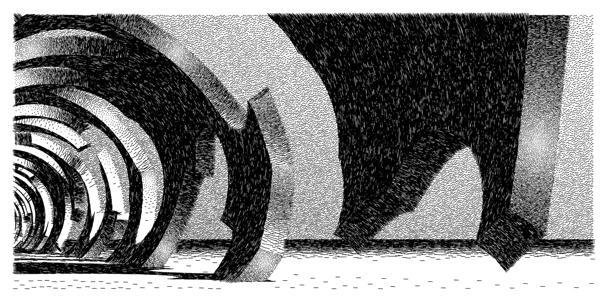

# You are here
*A CONCLUSION IS JUST WHERE YOU STOPPED THINKING*

*Hagelslag Age Cave Painting (November 2020)*

Piter Pasma is a generative artist, expressing himself through experiments with code and complexity. Inspired by randomness as an inspirational and creative force. Among the space of algorithms are buried gems in carefully tuned black boxes, concrete trap doors leading to unexpected dungeon forests, only seen when you open them a thousand times, sideways. 

Starting as a demoscener in 1998, he wrote four prize-winning 4 kilobyte demos (non-interactive real-time size-constrained audio-visuals). [Read more about my demoscene productions](demoscene)

Since then he has been honing his creative coding skills. 

He was lead organizer of [Genuary 2021](https://genuary2021.github.io/) and [Genuary 2022](https://genuary.art), generative art month, during which artists create daily pieces according to 31 carefully selected prompts. You can find many of these pieces by searching for #genuary/#genuary2021/#genuary2022 on social media (Twitter, Instagram). An open gallery of artist-submitted pieces from 2021 can be viewed at [symbiocene.gallery/genuary2021](https://www.symbiocene.gallery/genuary2021).

## articles

[Visual depth cues](articles/depth-cues)

[How did I do make the thing?](articles/oppy1)

[How to split polygons unevenly](articles/polysub)

[How to make interesting rotating things](articles/rotating)

(unfinished) [How to make sinusoid wobbly functions](articles/wobbly)

## art

For now, the best place to see my art is to check out [my Instagram Profile](https://www.instagram.com/piterpasma/). Sending me a message on Instagram or Twitter is currently probably also the best way to contact me, for questions about sales or collaboration.

In the future there will be a gallery page and other cool stuff on this very website. Because Instagram is not supposed to the canonical place to find my art.

## crypto art

I have also made a few NFTs! They are on the Hic Et Nunc, which is a proof of stake based crypto platform.

Check them out on my [Hic Et Nunc profile](https://www.hicetnunc.xyz/tz/tz1Kw8cEFuNLj21e5b42NBn1ANW7hupmbDbo). 

## 4 kilobyte demos

[Meuk](http://www.pouet.net/prod.php?which=343) ([video capture](https://vimeo.com/207039658)). Mekka & Symposium 2000, second place. Just wanted to mention, I also built the music/audio synthesis routines from scratch, a soft synth in about 1100 bytes :D

[Never Bored](http://www.pouet.net/prod.php?which=291) ([video capture](https://www.youtube.com/watch?v=gv-gHBz4hgw)). Takeover 1999, second place.

[Organic](http://www.pouet.net/prod.php?which=332). Ambience 1999, first place.

[Design?!](http://www.pouet.net/prod.php?which=333). Bizarre 1998, second place.

Dutch tech web magazine Tweakers also wrote a cool article about the demoscene, also featuring me: [Duitsland erkent demoscene als cultureel erfgoed waaronder kunst van Nederlander](https://tweakers.net/geek/179762/duitsland-erkent-demoscene-als-cultureel-erfgoed-waaronder-kunst-van-nederlander.html).

## stuff

[Test](test) please ignore.

[SCN Bookmarks](scn-bookmarks) please click.

[Pompoensoep recept](pompoensoep) please eat!

