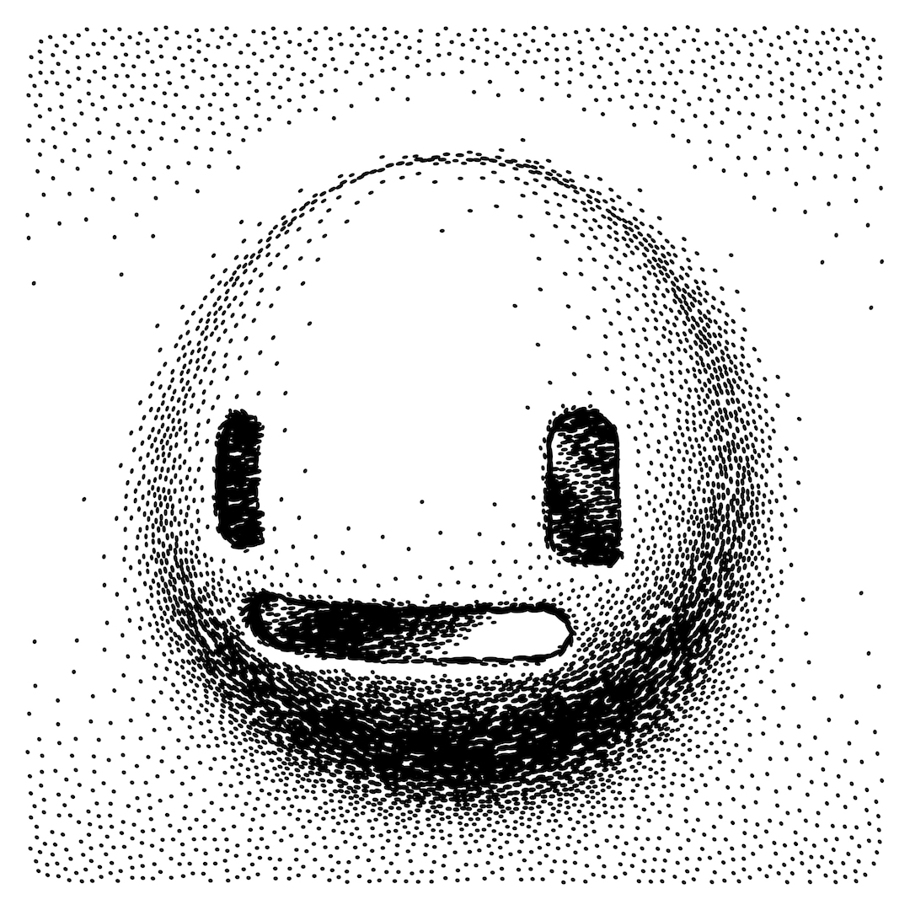
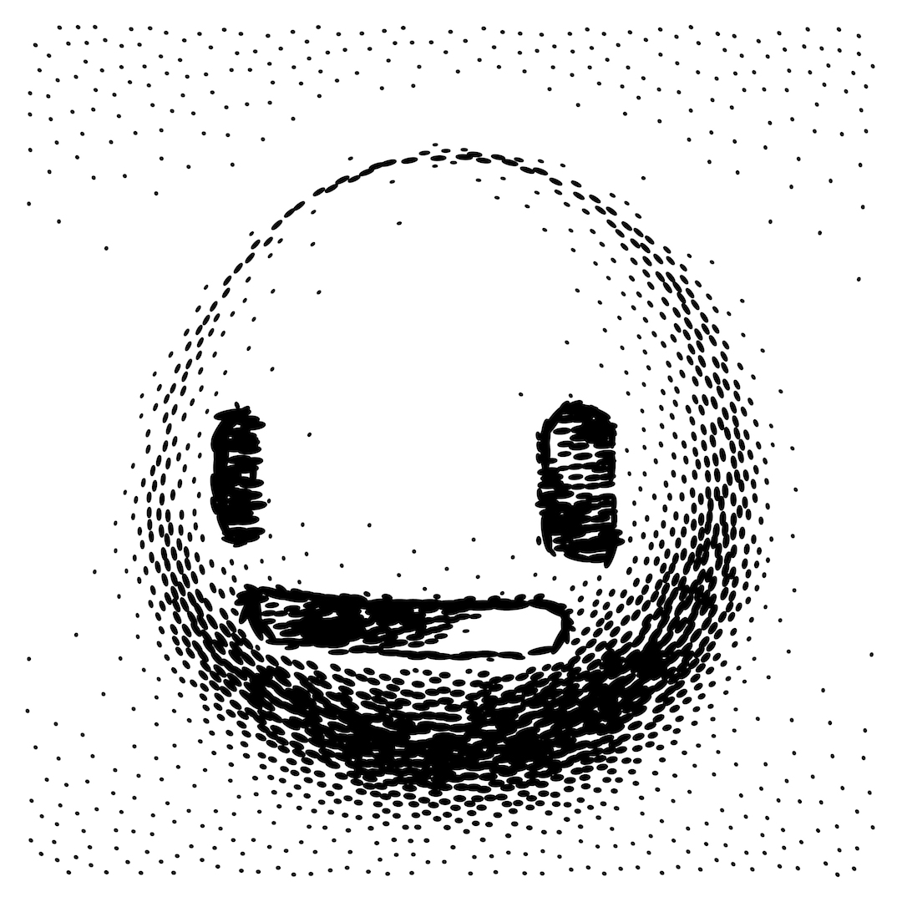

MASKS
=====

Title
-----

Masks

Artist
------

In some parts of the Universe known as Piter Pasma. Known for generative long form projects such as [Skulptuur](https://skulpturen.nl), [Blokkendoos](https://www.fxhash.xyz/project/blokkendoos), [Industrial Devolution](https://www.fxhash.xyz/project/industrial-devolution-1), [Universal Rayhatcher](https://fxwho.xyz/fxhash/urh/) and [many more](https://www.raster.art/artist/piter-pasma).

Piter Pasma is known for designing generators of three dimensional shapes using mathematical formulas expressing infinite variations, using unfathomably small amounts of code. Each of the above projects are less than 7KB of code, about half a page of inscrutable characters and esoteric incantations with no external dependencies, running in the browser.

He also is the lead organizer of [Genuary](https://genuary.art), the world-wide and possibly interplanetary celebrated generative art month.

Description
-----------

Who is the great master, that checks the vibe?

Nobody makes their own mask. Culturally relevant and molded to perfection.  

Your inner sanctum never felt safer. Vacancy guaranteed.

Technical Jargon
----------------

A "Masks" output is a plottable SVG that can be rendered in several different styles. This means configuratable page size, line thickness and dot detail level.

