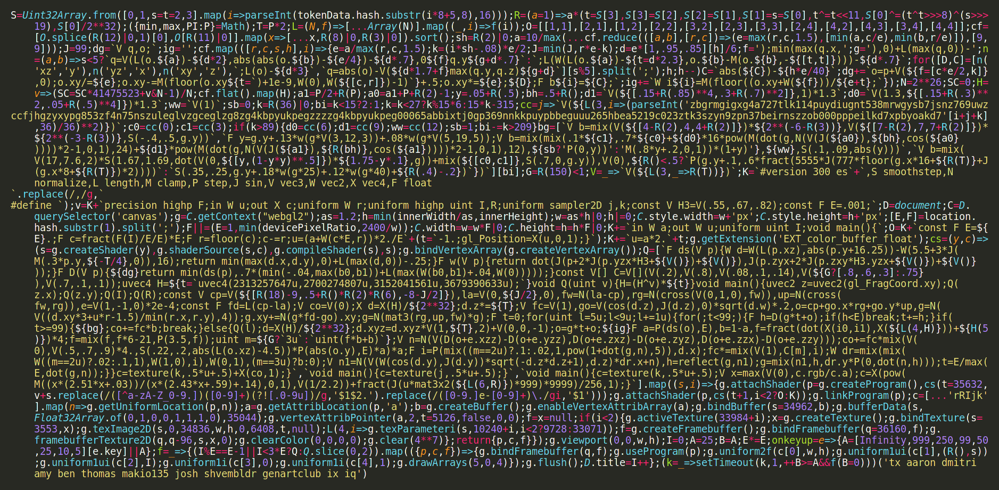

# The big Skulptuur Article

An exploration in generating forms in 3-dimensional space. This exclusive set of sculptures has been carved from a sea of infinite possibilities, much like a sculptor creates a singular reality from the potential in a block of stone. The shapes are illuminated by a variety of complex virtual lighting environments and yet the piece retains algorithmic minimalism with the code reduced to its pure essence -- **6370 bytes**.

*The entirety of Skulptuur's code*

## inspiration

2015 CPU pathtracer in Processing using my own Vec3 class

2020 december, rayhatcher, other raymarching stuff (genuary)

2021 GPU pathtracer

algorithmic sculpture 1

## the skulptuur algorithm

many example pictures

## renderer improvements

exposure function (up to 11!)

round edges

circular focus blur

## environments

about environments, they are both the light source and the background. 

### catalog

### shadows
  - city
  - foliage

### clouds
  - solid clouds
  - not solid clouds

## size optimizing

flipping every bit, twice

writing code between lines

using a larger font

tightening GLSL with regex

going critical: beyond Kolmogorov

## rendering options

two options, what they do

table

resolution limitation

## known bugs

shadow/city environment can have different skyline on different GPUs

## unknown bugs

Certain configurations of reflective surfaces may obtain sentience -- do not engage, make sure to keep offline.

I'm not so certain about Math itself. There's this *Axiom of Choice* thing that is highly suspect.

