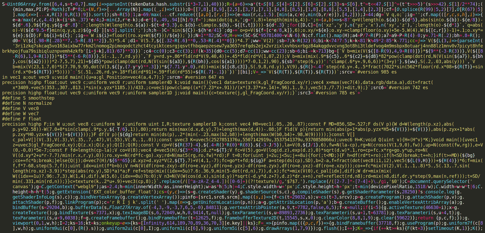
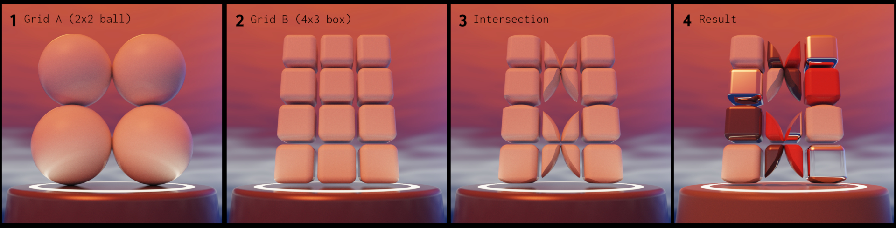

# Skulptuur

An exploration in generating forms in 3-dimensional space. This exclusive set of sculptures has been carved from a sea of infinite possibilities, much like a sculptor creates a singular reality from the potential in a block of stone. The shapes are illuminated by a variety of complex virtual lighting environments and yet the piece retains algorithmic minimalism with the code reduced to its pure essence -- **seven thousand bytes**.

*The entirety of Skulptuur's code*

Let that sink in for a while. You don't need to understand the code, but this -- less than half a page of symbols -- can produce this incredible variety of unique and beautiful highly photo realistic images.

## The Algorithm

*The Algorithm.*

First, two different grid sizes are selected. Each grid gets an assigned shape. A shape can be either solid, hollow or double shelled.

These two grids are then intersected (step 3), meaning only space that is common to both shape grids, remains.

Finally the resulting shape is assigned colour and material, which is uniquely linked to its shape.

## Rendering speed

If you have a fast/powerful computer, you can set the rendering speed higher by pressing 6 or 7.

Similarly, if you have a slower computer, try pressing 1 first, and slowly work your way up until the load is acceptable. It is advisable to reload and hit 1 immediately, because if the load is too high at default speed (5), the browser tab may become unresponsive.

Pressing 0 completely stops rendering.

## Safari

Skulptuur does not run by default on the current version of Safari. It does, however, run in the TP (technology preview) version.

In the current version of Safari, it is possible to enable WebGL2 by first enabling developer options, and then enabling the WebGL2 flag.

## Tiled rendering

(to be implemented)

Splinters of wood from the shipyard were collected downstream to make boats that are not boats. A fleeting war. Only common ground remained, unrecognizable, and majestic.
